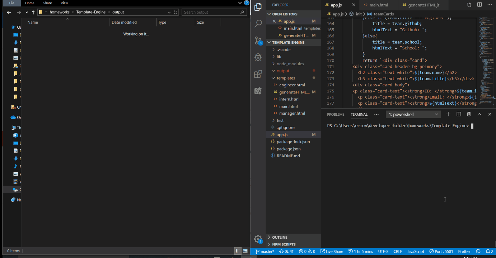
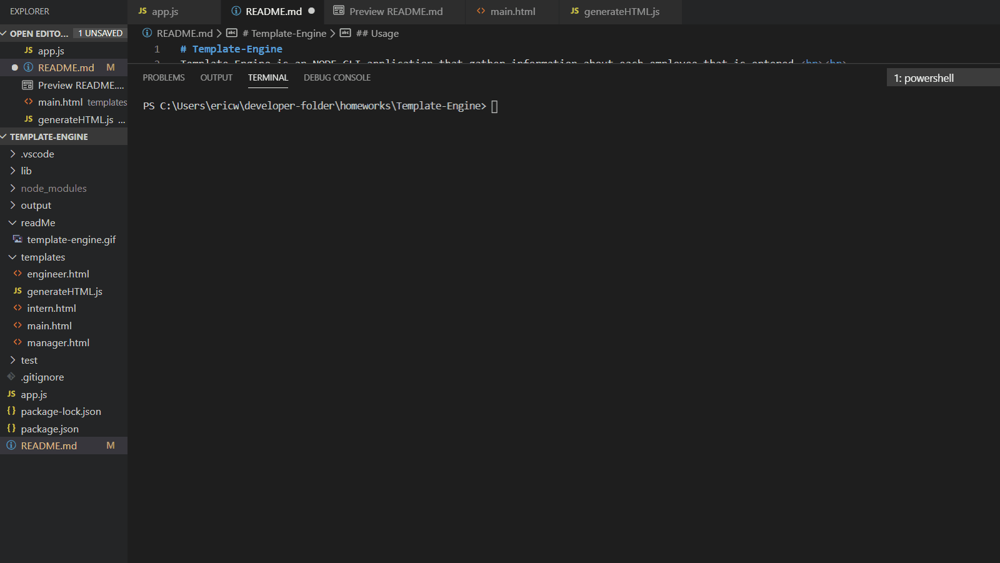

# Template-Engine
Template Engine is an NODE CLI application that gather information about each employee that is entered.  

## Usage
Getting started with install the NPM package. (npm i in the terminal)
Run through the various prompted questions and once all the desired employees have been entered. To exit out the application by selecting No.

Once completed an HTML page will display cards of the employees and their respected titles.

## NPM class testing

## Credit
<ul>
<li>Jonathan (Instructor) </li>
Jonathan helped me with using the mapping the array of objects
<li>Maxwell (TA)</li>
Maxwell helped me with the if else statement when manipulating the DOM
<a href="https://www.youtube.com/watch?v=r9HdJ8P6GQI&t=1023s"><li>AcadeMind</li></a>
Great video that scratches the surface of testing with Jest
<a href="https://www.youtube.com/watch?v=pDou2WCoipE"><li>Caleb Curry</li></a>
A video about the switch state to help with choosing roles during the prompt
<li>W3Schools</li>
Helped with the super in the test. Super pulls from the parent class's method so it's less lines of code.
</ul>

## License
Code is open and free to view and use.